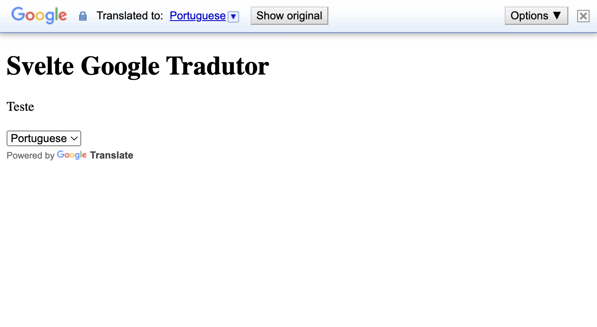

# Svelte Google Translate

## Installation

```bash
npm i @candidosales/svelte-google-translate
```



### Usage

```svelte
<script>
	import { GoogleTranslate } from '@candidosales/svelte-google-translate';
</script>

<h1>Svelte Google Translate</h1>
<GoogleTranslate
	elementId={'google-translate-element'}
	options={{ pageLanguage: 'pt', includedLanguages: 'pt,en' }}
/>
<div id="google-translate-element">
	<p>Test</p>
</div>
```

| Attributes |        Default value         | Description                                                                                 |
| ---------- | :--------------------------: | ------------------------------------------------------------------------------------------- |
| elementId  | `'google-translate-element'` | This option specifies the HTML element ID. The default value is `google-translate-element`. |
| options    |                              | This option specifies all config that TranslateElementOptions provides.                     |

### Options

| Option            |        Default value        | Description                                                                                                                                                                                                                                                                           |
| ----------------- | :-------------------------: | ------------------------------------------------------------------------------------------------------------------------------------------------------------------------------------------------------------------------------------------------------------------------------------- |
| pageLanguage      |           `'pt'`            | This option specifies the language of the page that you want to translate. The default value is "auto", which means that Google will detect the language automatically.                                                                                                               |
| includedLanguages | `'pt,en,es,fr,nl,ja,zh-CN'` | This option is an array of language codes that you want to include in the language selector. If you don't specify this option, Google will include all languages that are supported by the API. Supported languages: https://cloud.google.com/translate/docs/languages.               |
| layout            |           `true`            | This option specifies the layout of the language selector. The default value is "horizontal", which displays the language names in a row. Other options include "vertical" (displays the language names in a column) and "dropdown" (displays the language names in a dropdown menu). |
| autoDisplay       |           `true`            | This option specifies whether or not to display the language selector automatically. The default value is true.                                                                                                                                                                       |
| multilanguagePage |           `false`           | This option specifies whether or not the page being translated contains multiple languages. The default value is false.                                                                                                                                                               |
| gaTrack           |           `false`           | This option specifies whether or not to track translation events using Google Analytics. The default value is false.                                                                                                                                                                  |
| gaId              |             ``              | This option specifies the Google Analytics tracking ID to use if gaTrack is set to true.                                                                                                                                                                                              |
| layoutCompact     |           `false`           | This option specifies whether to use a compact layout for the language selector. The default value is false.                                                                                                                                                                          |
| floatPosition     |         `TOP_LEFT`          | This option specifies the position of the language selector if layoutCompact is set to true. The default value is "TOP_LEFT", other options include "TOP_RIGHT", "BOTTOM_LEFT", and "BOTTOM_RIGHT".                                                                                   |
| timeout           |           `5000`            | This option specifies the time in milliseconds before the API returns an error if it fails to load. The default value is 5000.                                                                                                                                                        |
| newVersion        |           `false`           | This option specifies whether to use the new version of the Google Translate API. The default value is false.                                                                                                                                                                         |
| attribution       |           `true`            | This option specifies whether to display the "Powered by Google Translate" attribution. The default value is true.                                                                                                                                                                    |

## 👍 Contribute

If you want to say thank you and/or support the active development this project:

1. Add a [GitHub Star](https://github.com/candidosales/svelte-google-translate/stargazers) to the project.
2. Tweet about the project [on your Twitter](https://twitter.com/intent/tweet?url=https%3A%2F%2Fgithub.com%2Fcandidosales%2Fsvelte-google-translate).
3. Write a review or tutorial on [Medium](https://medium.com/), [Dev.to](https://dev.to/) or personal blog.
4. Support the project by donating a [cup of coffee](https://buymeacoff.ee/candidosales).

## ☕ Supporters

If you want to support Svelte Google Translate, you can ☕ [**buy a coffee here**](https://buymeacoff.ee/candidosales)

## Author

- Cândido Sales - [@candidosales](https://twitter.com/candidosales)

## ⚠️ Copyright and license

Code and documentation copyright 2020-2030 the [Authors](https://github.com/candidosales/svelte-google-translate/graphs/contributors) and Code released under the [MIT License](https://github.com/candidosales/svelte-google-translate/blob/master/LICENSE). Docs released under [Creative Commons](https://creativecommons.org/licenses/by/3.0/).

## Test Locally

```bash
npm run dev
```
